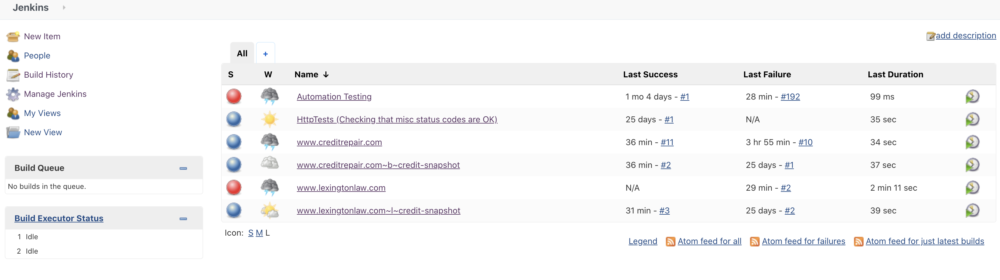
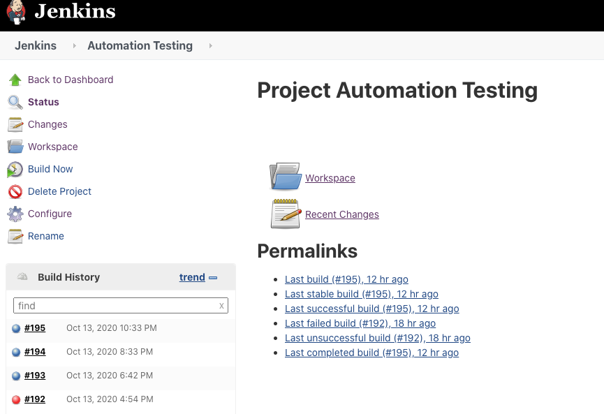
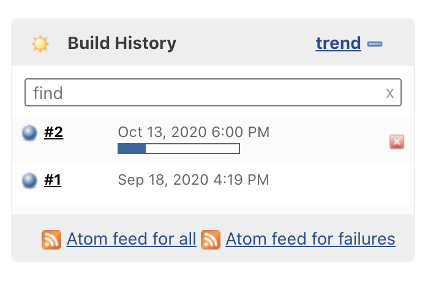
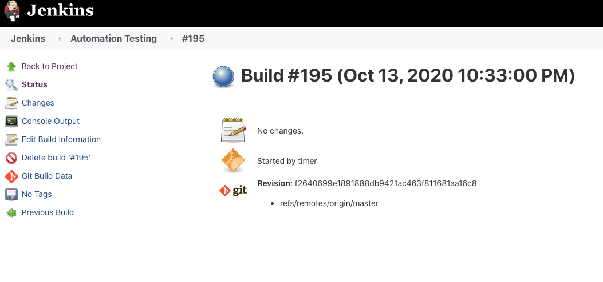
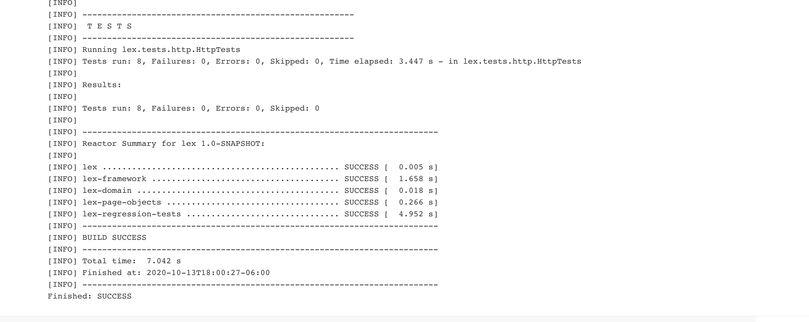
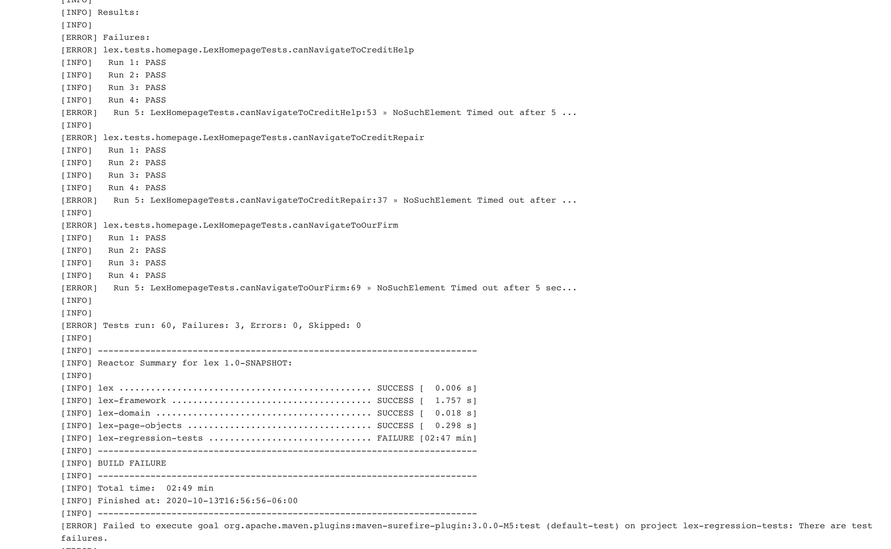
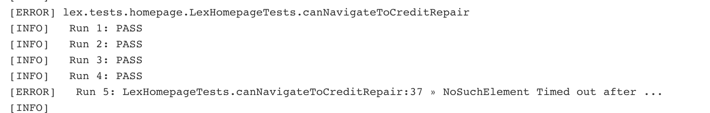
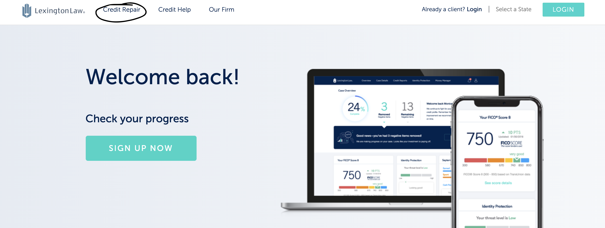
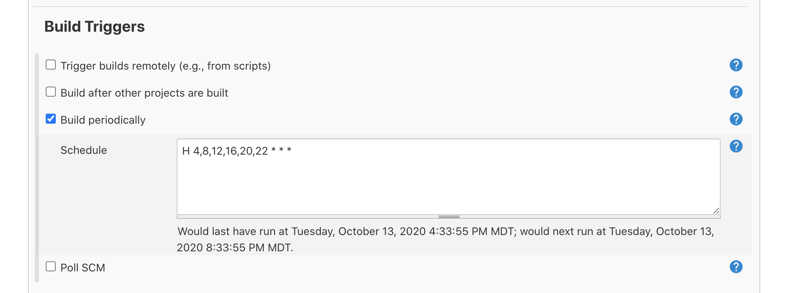

# Running Automation

1. First, navigate to **http://martech-d01.vwsl.pgx.local:8080/** This is where the jenkins server is hosted. You must navigate to this server to run the automation test suite, or individual test suites.
2. You should see a screen that says, **Welcome to Jenkins!** fill in the following fields:\
   *Username*: **admin**\
   *Password*: **admin**\
   and click **Sign in**
3. You should see the main Jenkins page with a list of projects. To run an automation suite, click on a project name. 
4. On the project screen, click **Build Now** on the left. 
5. A few seconds later you will see a flashing build icon and a progress bar under **Build History**. 
6. The tests are running now, you can click on the **Build #** to see this page while in the build is in progress, or after it is finished.  *(You can click on Console Output for more information)*
7. When the build finishes, you will see a blue circle if all the tests passed and a red circle if something went wrong. (The latest build status will be displayed on the main screen)

# Figuring Things Out (Pass/Fail)

1. For the time being, figuring out why things failed can be tricky. Hopefully this will be made a little easier in the future. Sign into Jenkins and click on a project (pass/fail), indicated by a blue/red circle
2. Click on the build you are interested in under, **Build History**
3. Click **Console Output** on the left
4. Scroll through the output to the bottom, you should see something like this for a pass: 
Or this, for a fail: 
In these results sections you can see the number of Tests run, the number of failures, the number of errors, and the number of tests skipped. You may have a positive number under skipped if the Retry Analyzer had to retry any test cases.
The automation suite makes use of the RetryAnalyzer class, so tests will retry up to 5 times before they are flagged as a fail. If a test is failing here, it means it failed 5 times in a row. (Test failures either mean there were website code changes that broke the test, or something is wrong with the website that caused the test to fail.) You can read the test name to get a better idea of what went wrong. Let us look at a failing test case here:
For example, let us look at **lex.tests.homepage.LexHomepageTests.canNavigateToCreditRepair**. The important part of this is the last two phrases **LexHomepageTests** and **canNavigateToCreditRepair**. You can see this in the image next to **Run 5:**, **LexHomePageTests** is the Java class name that references we were running tests on the lexington law homepage. **canNavigateToCreditRepair** is the name of the test that failed. Reading these two, we can infer that from the Lexington Law Homepage, we were not able to navigate to Credit Repair. Let us go over to the Lexington Law homepage and see if we can figure out what went wrong.
Looking at lexingtonlaw.com, I can see the Credit Repair button up in the top. 

Clicking on this link worked for me, so it seems there was just a website change that broke this particular test. 

# Changing Email Recipients and Build Schedule

### Build Schedule Configuration

1. Sign into Jenkins and click on a project you would like to configure.
2. Click **Configure** on the left
3. Navigate to **Build Triggers**
4. Check **Build periodically** 
5. In the **Schedule** text field, enter a Cron string 
   - More information on Cron can be found here: [Cron](https://en.wikipedia.org/wiki/Cron)
   - For example, '**\* \* \* \* \***' runs every minute of every day.
   - '**H 4, 8, 12, 16, 20, 22 \* \* \***' runs at 4a, 8a, 12p, 4p, 8p, and 10p of every day (Times are UTC)

### Changing Email Recipients

1. Sign into Jenkins and click on a project you would like to configure.
2. Click **Configure** on the left
3. Navigate to **Post-build Actions**
4. Add any recipients you want in the **Recipients** text field [image](images/post-build.png)
5. Check **Send e-mail for every unstable build** to get email notifications for the above recipients on failed builds.

# Notes on Project Structure
The Jenkins project structure is as follows: 
- **Automation Testing** is the project that runs all automation tests when built
- **www** projects correspond to individual sites. If you want to run all current tests for a particular website, build one of these corresponding projects
- **HttpTests** sends requests to various sites and verifies that the response is an OK status code

